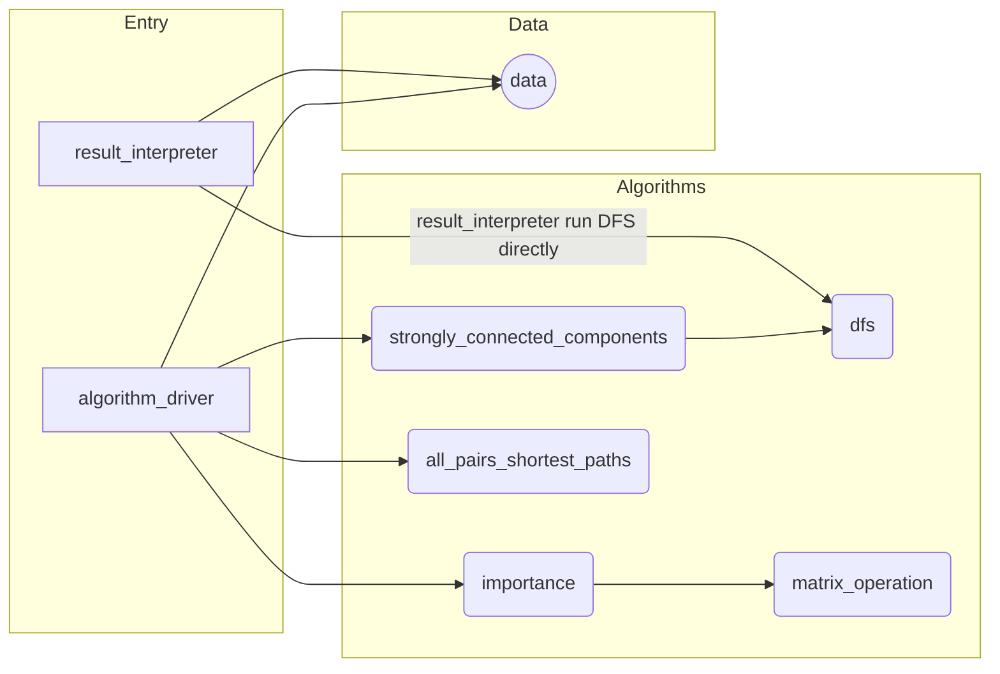

# CS 225 Final Project: OpenFlights

## Team Members: tluo9-yanzhen4-yirongc3

## Deliverables 

- [Report]()
- [Presentation Video]()
- [Presentation Slides]()

## Introduction

Our final project uses airports and route dataset from [OpenFlights](https://openflights.org/data.html) to find the shortest air-path between two given airports and the relatively important airports.

We implemented Floyd-Warshall algorithm to find the shortest path between two airports, PageRank algorithm to find important airports.

## File Description

```bash
.
├── README.md
├── bin
├── data                # contains the the airport and route dataset from OpenFlights
│   ├── airport.csv         # original airport file
│   ├── airport_small.csv   # first 200 lines of original airport file
│   └── route.csv           # original airport file
├── documents
│   ├── contract.md
│   ├── log.md
│   └── proposal.md
├── importance_it_explanation       # PageRank by iteration: correctness proof and complexity analysis
├── includes            # header files
│   ├── all_pairs_shortest_paths.h              # Floyd-Warshall
│   ├── data.h                                  # graph data structure and file utilities
│   ├── dfs.h                                   # abstract DFS
│   ├── filename_def.h                          # output filename constant definition
│   ├── importance.h                            # PageRank
│   ├── matrix_operation.h                      # matrix operation support for eigenvector implementation of PageRank
│   ├── strongly_connected_components.h         # strongly connected component
│   └── type.h                                  # data type declaration
├── makefile
├── obj
├── presentation_slides.pdf
├── reserve_obj
├── results.md
├── run_tests.sh                                # script: run all test cases (except tests_importance_mutual_actual; reason see the end of readme)
├── sample_result.tar.gz                        # pre-computed result package (can be passed into result_interpreter directly)
├── src                 # source files (repeated file description see "includes")
│   ├── algorithm_driver.cpp                    # entry: algorithm_driver
│   ├── all_pairs_shortest_paths.cpp
│   ├── data.cpp
│   ├── importance.cpp
│   ├── result_interpreter.cpp                  # entry: result_interpreter
│   └── strongly_connected_components.cpp
└── tests                                       # test cases
    ├── catch.cpp
    ├── catch.hpp
    ├── tests_all_pairs_shortest_paths.cpp
    ├── tests_dfs.cpp
    ├── tests_importance.cpp
    ├── tests_importance_mutual_actual.cpp
    ├── tests_matrix_operation.cpp
    ├── tests_strongly_connected_components.cpp
    ├── tests_utilities.cpp
    └── tests_utilities.h
```

Note: the following chart relies on "mermaid".  



The main entry is divided into two part: algorithm_driver and result_interpreter. 
The reason of that is algorithm_driver will run all algorithms and takes ~82min on EWS 
since it runs all algorithm and major time spent on Floyd-Warshall (~70min). 
We divide the responsibilities into two part: computational (algorithm_driver) and user interaction (result_interpreter). 

Data and algorithms are independent of each other, and the connection between them is controlled by the entry part. 

The result_interpreter is nearly independent to algorithms unless the following exception:
result_interpreter run DFS directly (b/c it is fast, and it enables running DFS from any origin per user's request). 

Remark: Code style conforms to [Google C++ Style Guide](https://google.github.io/styleguide/cppguide.html). 

## Running Instruction

### Main Drivers

#### algorithm_driver 

Run strongly connected components algorithm, three algorithms finding importance of airports, and Floyd-Warshall. 
Then store raw data in csv and zip into `result.tar.gz` because raw data is very big (~800MB).

- Compile: `make algorithm_driver`

- Run: `./bin/algorithm_driver <airport-dataset-filename> <airline-dataset-filename>` 

(`<airport-dataset-filename>` and `<airline-dataset-filename>` are optional 
and the default values are `data/airport.csv` and `data/route.csv`)

There are 6072 airports in `data/airport.csv`. 
To short run time (for the purpose of demo), 
we can use `./bin/algorithm_driver data/airport_small.csv` 
where `data/airport_small.csv` only contains first 200 airports in `data/airport.csv`. 

#### result_interpreter 

Read result from algorithm_driver. 
Interact with users. 

- Compile: `make result_interpreter`

- Run: `./bin/result_interpreter <result-zip-filename>`

(`<result-zip-filename>` is optional 
and the default value is `result.tar.gz`)

We can run `./bin/result_interpreter sample_result.tar.gz` 
to interpret the precomputed result from the default dataset (`data/airport.csv` and `data/route.csv`). 

The result_interpreter provides 5 interactive command

- `dfs <origin-iata-code>`: run DFS with the specific origin airport `<origin-iata-code>`
- `scc <iata-code>`: find the index (unique identifier) of the strongly connected component contains airport `<iata-code>`
- `sp <departure-iata-code> <destination-iata-code>`: find the shortest path from the airport `<departure-iata-code>` to the airport `<destination-iata-code>`
- `top <limit-number>`: find the `<limit-number>` most important airports
- `rank <iata-code>`: find importance of the airport `<iata-code>`

### Test Cases (exclude tests_importance_mutual_actual)

- Compile + Run: `sh run_tests.sh`

### Test Case (only tests_importance_mutual_actual)

- Compile: `make tests_importance_mutual_actual`

- Run: `./bin/tests_importance_mutual_actual`

This will take ~12min on EWS.

The reason of excluding this test case from "tests all" is 
this test case takes too long 
since it compares the result of `ImportanceIteration`, `ImportanceEigenvectorByLU` and `ImportanceEigenvectorByGaussian` mutually by inputing the default dataset (`data/airport.csv` and `data/route.csv`).
