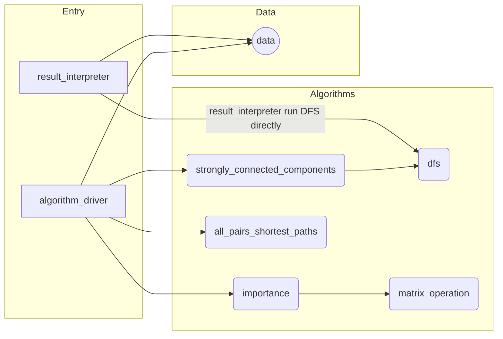

Note: the following chart relies on "mermaid".  

```mermaid
graph LR;
    subgraph Entry
        A[algorithm_driver];
        B[result_interpreter];
    end

    subgraph Algorithms
        H(dfs);
        I(strongly_connected_components);
        J(matrix_operation);
        K(importance);
        L(all_pairs_shortest_paths);
    end

    subgraph Data
        W((data));
    end

    A-->W;
    B-->W;

    A-->I;
    I-->H;
    A-->K;
    K-->J;
    A-->L;

    B-->|result_interpreter run DFS directly|H;
```
